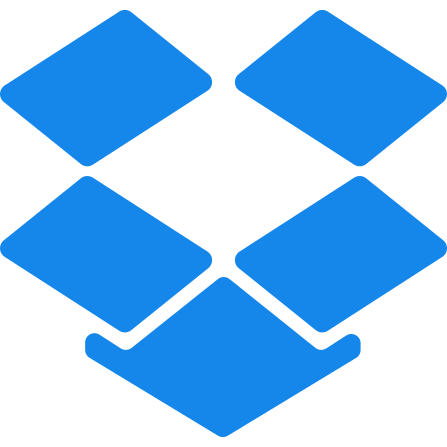

# Leidos Rollvan - Android App 

### Leidos Rollvan is a self-hosted food-truck information app.  
Unlike other services, Leidos Rollvan is free and open source.  
Leidos Rollvan is an app commissioned by Leidos to Level 3 University of Glasgow students as part of their Honours Team Project.

Leidos Rollvan app is available from the following **download links**

 

 

## About

Leidos Rollvan has been made for you to comfortably explore and browse the best local food trucks in your area.
It provides a platform to smaller, independent business owners to advertise their businesses and reach a wider user base in a highly competitive space dominated by large chain businesses. 

This android application allows users to explore nearby food trucks on a simple Map based UI and discover great, cost-effective deals being offered by local businesses in real-time.

With a free registered account, users can gain access to a subscription feature to their favourite food trucks to stay updated with changes and never miss any ongoing offers. A registered account also helps users add their most frequented food trucks to a favourites list so they can be accessed at any time. However, this app is completely usable without registering an account with us. 

Business owners have to register for a business account to advertise their businesses to users. They can create and customise their business profile to attract more clients and be informative about their available food menus. Businesses have the ability to create and notify all subscribed clients about their ongoing offers at the touch of a button. Business locations are very easily changeable to allow mobile food trucks to keep their locations updated regularly. 

This application was originally created by:
- Anirbit Ghosh
- Alex Chak
- Kieran Sharp
- Ben Johnston
- German Cherstvov
It was released under the GNU GPLv3.

## How to install the app?

If you are a new user looking to get started with the Leidos Rollvan app, follow the simple instructions given below:

  - Use one of the available download links above (_Dropbox, Google Drive or One Drive_) to download the APK of the app to your computer or mobile device. 
  - If you downloaded the APK to your computer, transfer the downloaded file to your mobile device with an appropriate USB cable. If you downloaded the APK to your phone directly, follow on from step 3. **NOTE: Downloading directly to your phone may require enabling permissions to download from untrusted sources.**
  - Once you have the APK downloaded to your phone, using your Android file manager locate the downloaded APK file. 
  - Simply click on the APK and run the file to begin the installation process. 
  - One installed, locate the app on your homescreen and get started!

## Screenshots

  
  
  
  
  
  
  
  
  \
  

## Permissions

With at least android version 8 for stable performance, Leidos Rollvan requires the following permissions:
- Full Network Access.
- Fine and Coarse location access.
- Push notifications permission (optional).
- Read access from internal media storage.

The "Read access from internal media storage" permission is only used for Business accounts to upload a profile banner image for their page otherwise it is not used for User accounts. The network access permissions are made use of for retrieving server content. The Fine and Coarse location permissions is used to display user's location on the Map and is needed to be able to make use of any map features at all.

## Release Notes

### March 17, 2022 - Leidos Rollvan v1.0 - Features:

Users can:
- Discover local food truck businesses - See the food items on sale, any ongoing offers, their opening-closing times and the contact details of all registered businesses
- Use a name based search feature to find their desired rollvan business or use the various filters to narrow down the search to the exact type of food they are looking for
- Explore businesses on a map based UI to be able to see directions, travel time and distances to any registered business
- Search for any destination and plot a route to it on the map UI, to discover all businesses along the given route
- Register for a free User account with a verified email address for the following benefits:
    - Subscribe to businesses to receive push notifications whenever they have ongoing offers and deals
    - Save your favourite businesses for easy access

Business owners can:
- Register to advertise their food truck business - business accounts must be verified via the email provided
- Customise the look of their page to attract more customers - add a banner image, update food items and their prices under various preset sections, set opening and closing times and select the days when they remain open
- Add category tags to their business to allow users to locate their business under appropriate category filters
- Add a location to allow users to find their business on the map UI
- Create and notify subscribed users about ongoing offers and deals

#### Known Bugs in current release

Limitations and bugs identified in the current version of the app:
- Map fails to load on startup. Requires refreshing the map page several times to render all map data. On some devices rapidly refreshing the map page twice will load the map immediately and continue working as expected. The cause of this bug was not identified and solved as it could not be recreated on the development environment's Android emulator. It is only a bug experienced when using this feature on a real mobile device with the latest Android version.

## License

This application is released under GNU GPLv3 (see [LICENSE](LICENSE)).
Some of the used APIs are released under different licenses.
